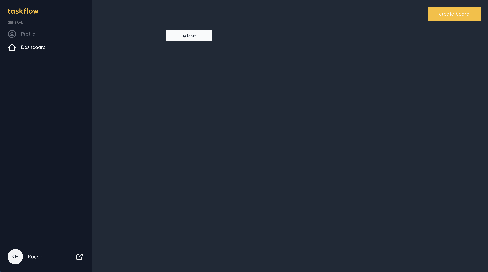
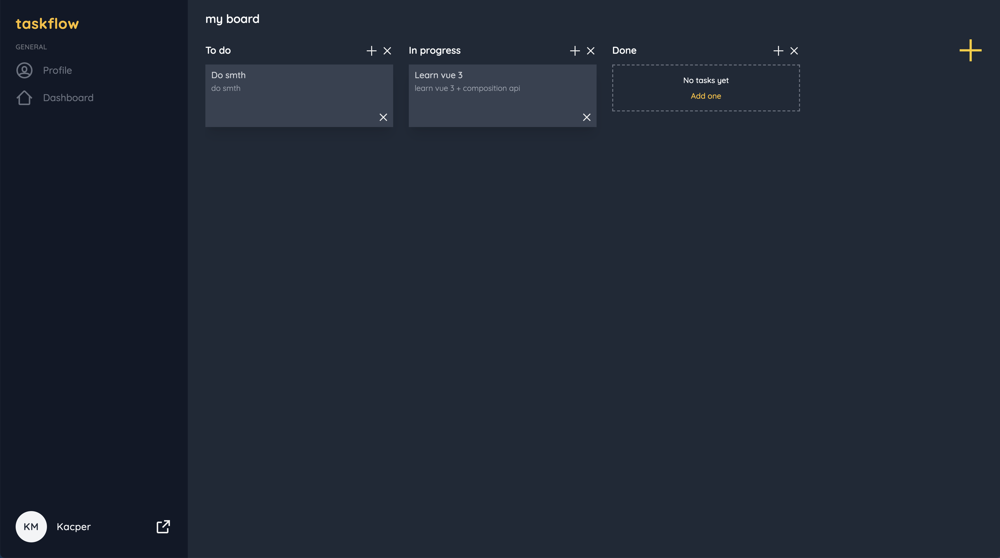

# taskflow--frontend

## How to run (development-mode) ?

At first run the back-end service: https://github.com/porithe/taskflow--backend

`npm install`

then

`npm run serve`

## To improve

    - Change task positions(back-end) 

## Screenshots

